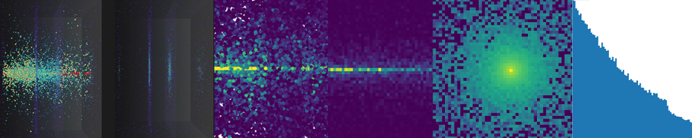

<h1 align="center"><b>PyTissueOptics</b></h1>

<p align="center"><i>Monte Carlo simulations of light transport made easy.</i></p>
<p align="center">

</p>

This python package is an object-oriented implementation of Monte Carlo modeling for light transport in diffuse media. 
The package is very **easy to set up and use**, and its mesh-based approach makes it a **polyvalent** tool to simulate light transport in arbitrarily complex scenes. 
The package offers both a native Python implementation and a hardware-accelerated version using OpenCL. 

As discussed in the [why use this package](#why-use-this-package) section, computation time isn't the only variable at play. This code is **easy to understand**, **easily scalable** and **very simple to modify** for your need. It was designed with **research and education** in mind.

## Notable features
- Arbitrarily complex 3D environments.
- Import external 3D models (.OBJ).
- Great data visualization with `Mayavi`.
- Multi-layered tissues.
- Hardware acceleration with `OpenCL`.
- Accurate Fresnel reflection and refraction with surface smoothing.
- Discard 3D data (auto-binning to 2D views).
- Independent 3D graphics framework under `scene`. 

## Installation
Requires Python 3.6+ installed on the device.

PyTissueOptics can be installed via `pip` or by cloning the repository.

### Installing the development version
1. Clone the repository.
2. Create a virtual environment inside the repository with `python -m venv venv`.
3. Activate the virtual environment. 
    - On MacOS/Linux: `source venv/bin/activate`.
    - On Windows: `venv\Scripts\activate.bat`.
4. Upgrade `pip` with `pip install --upgrade pip`.
5. Install the package requirements with `pip install -r requirements.txt`.

### Installing the previous release
> Currently, this `pip` version is outdated. We recommend installing the development version.
```shell
pip install pytissueoptics
```

## Getting started
A command-line interface is available to help you run examples and tests.
```shell
python -m pytissueoptics --help
python -m pytissueoptics --list
python -m pytissueoptics --examples 1,2,3
python -m pytissueoptics --tests
```

To launch a simple simulation on your own, follow these steps.
1. Import the `pytissueoptics` module
2. Define the following objects:
    - `scene`: a `ScatteringScene` object, which defines the scene and the optical properties of the media, or use a pre-defined scene from the `samples` module. The scene takes in a list of `Solid` as its argument. These `Solid` will have a `ScatteringMaterial` and a position. This is clear in the examples below.
    - `source`: a `Source` object, which defines the source of photons.
    - `logger`: an `EnergyLogger` object, which logs the simulation progress ('keep3D=False' can be set to auto-bin to 2D views).
3. Propagate the photons in your `scene` with `source.propagate`.
4. Define a `Viewer` object and display the results by calling the desired methods. It offers various visualizations of the experiment as well as a statistics report.

Here's what it might look like:
```python
from pytissueoptics import *

material = ScatteringMaterial(mu_s=3.0, mu_a=1.0, g=0.8, n=1.5)

tissue = Cuboid(a=1, b=3, c=1, position=Vector(2, 0, 0), material=material)
scene = ScatteringScene([tissue])

logger = EnergyLogger(scene)
source = PencilPointSource(position=Vector(-3, 0, 0), direction=Vector(1, 0, 0), N=1000)
source.propagate(scene, logger)

viewer = Viewer(scene, source, logger)
viewer.reportStats()
viewer.show3D()
```
Check out the `pytissueoptics/examples` folder for more examples on how to use the package.

## Hardware acceleration
```python
source = DivergentSource(useHardwareAcceleration=True, ...)
```
Hardware acceleration can offer a speed increase factor around 1000x depending on the scene. 
By default, the program will try to use hardware acceleration if possible, which will require OpenCL drivers for your hardware of choice. 
NVIDIA and AMD GPU drivers should contain their corresponding OpenCL driver by default. 
To force the use of the native Python implementation, set `useHardwareAcceleration=False` when creating a light `Source`.

Follow the instructions on screen to get setup properly for the first hardware accelerated execution which will offer 
to run a benchmark test to determine the ideal number of work units for your hardware. 

## Why use this package
It is known, as April 2022, Python is **the most used** language ([Tiobe index](https://www.tiobe.com/tiobe-index/)).
This is due to the ease of use, the gentle learning curve, and growing community and tools. There was a need for 
such a package in Python, so that not only long hardened C/C++ programmers could use the power of Monte Carlo simulations.
It is fairly reasonable to imagine you could start a calculation in Python in a few minutes, run it overnight and get
an answer the next day after a few hours of calculations. It is also reasonable to think you could **modify** the code
yourself to suit your exact needs! (Do not attempt this in C). This is the solution that the CPU-based portion of this package 
offers you. With the new OpenCL implementation, speed is not an issue anymore, so using `pytissueoptics` should not even be a question.

### Known limitations
1. It uses Henyey-Greenstein approximation for scattering direction because it is sufficient most of the time.
2. Reflections are specular, which does not accounts for the roughness of materials. It is planned to implement Bling-Phong reflection model in a future release.

## Examples

### Multi-layered phantom tissue
Located at `examples/rayscattering/accelerated/exampleSimple.py`.
Using a pre-defined tissue from the `samples` module.

```python
N = 500000
scene = samples.PhantomTissue()
source = DivergentSource(position=Vector(0, 0, -0.1), direction=Vector(0, 0, 1), N=N, diameter=0.2, divergence=np.pi / 4)
logger = EnergyLogger(scene)
source.propagate(scene, logger=logger)

viewer = Viewer(scene, source, logger)
viewer.reportStats()

viewer.show2D(View2DProjectionX())
viewer.show2D(View2DProjectionX(solidLabel="middleLayer"))
viewer.show2D(View2DSurfaceZ(solidLabel="middleLayer", surfaceLabel="interface0"))
viewer.show1D(Direction.Z_POS)
viewer.show3D()
```

#### Default figures generated


#### Discarding the 3D data
When the raw simulation data gets too large, the 3D data can be automatically binned to pre-defined 2D views. 
```python
logger = EnergyLogger(scene, keep3D=False)
```
All 2D views are unchanged, because they are included in the default 2D views tracked by the EnergyLogger. 
The 1D profile and stats report are also properly computed from the stored 2D data.
The 3D display will auto-switch to Visibility.DEFAULT_2D which includes Visibility.VIEWS with ViewGroup.SCENE (XYZ projections of the whole scene) visible by default. 


#### Display some 2D views with the 3D point cloud
The argument `viewsVisibility` can accept a `ViewGroup` tag like SCENE, SURFACES, etc., but also a list of indices for fine control. You can list all stored views with `logger.listViews()` or `viewer.listViews()`. 
Here we toggle the visibility of 2D views along the default 3D visibility (which includes the point cloud). 
```python
logger = EnergyLogger(scene)
[...]
viewer.show3D(visibility=Visibility.DEFAULT_3D | Visibility.VIEWS,  viewsVisibility=[0, 1])
```


#### Display custom 2D views
If `keep3D=False`, the custom views (like slices, which are not included in the default views) have to be added to the logger before propagation like so:
```python
logger = EnergyLogger(scene, keep3D=False)
logger.addView(View2DSliceZ(position=0.5, thickness=0.1, limits=((-1, 1), (-1, 1))))
logger.addView(View2DSliceZ(position=1, thickness=0.1, limits=((-1, 1), (-1, 1))))
logger.addView(View2DSliceZ(position=1.5, thickness=0.1, limits=((-1, 1), (-1, 1))))
```
If the logger keeps track of 3D data, then it's not a problem and the views can be added later with `logger.addView(customView)` or implicitly when asking for a 2D display from `viewer.show2D(customView)`.


#### Display interactive 3D volume slicer
Requires 3D data.
```python
viewer.show3DVolumeSlicer()
```


#### Save and append simulation results
The `EnergyLogger` data can be saved to file. This can also be used along with `keep3D=False` to only save 2D data. Every time the code is run, the previous data is loaded and extended. This is particularly useful to propagate a very large amount of photons (possibly infinite) in smaller batches so the hardware doesn't run out of memory.
```python
[...]
logger = EnergyLogger(scene, "myExperiment.log", keep3D=False)
source.propagate(scene, logger)
logger.save()
```

## Acknowledgment
This package was first inspired by the standard, tested, and loved [MCML from Wang, Jacques and Zheng](https://omlc.org/software/mc/mcpubs/1995LWCMPBMcml.pdf) , itself based on [Prahl](https://omlc.org/~prahl/pubs/abs/prahl89.html) and completely documented, explained, dissected by [Jacques](https://omlc.org/software/mc/) and [Prahl](https://omlc.org/~prahl/pubs/abs/prahl89.html). This would not be possible without the work of these pioneers.
