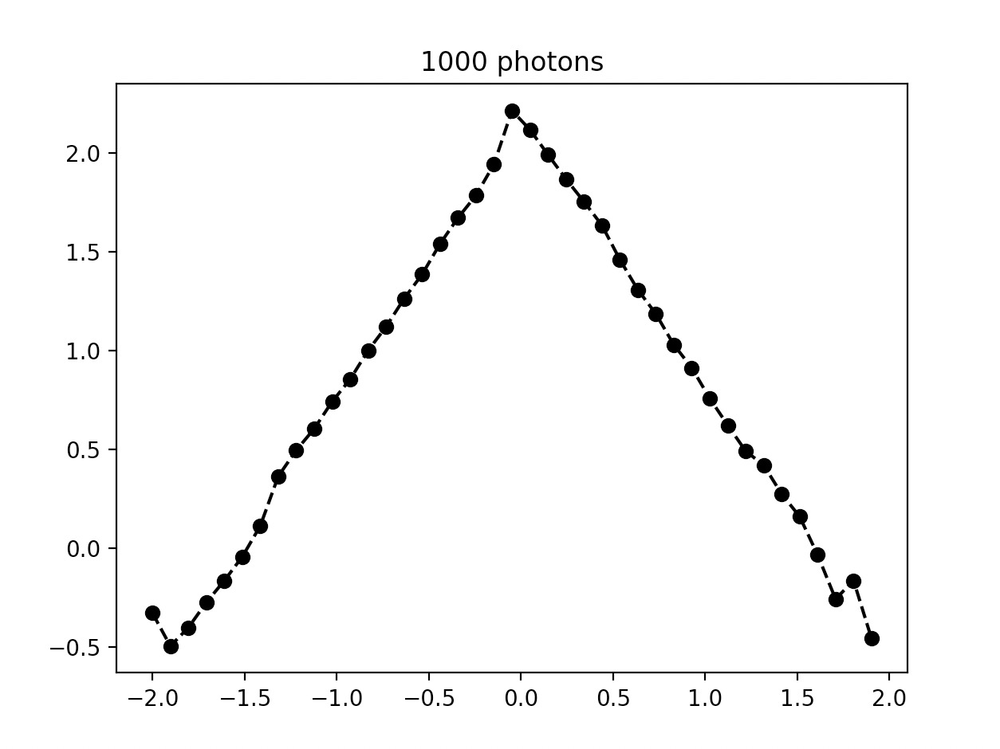

# Light propagation with Monte Carlo in Python

This is an extremely simple object-oriented code in Python that simulates the propagation of light in scattering tissue. It is not just *simple*: it is **outrageously simple** and **very slow** (see below). However, it is **extremely easy to understand** and most importantly **very simple modify**.

It may be slow, but speed is more than code performance: anyone with little to no experience can simulate something instantly instead of having to understand C, C++ or, god forbid, GPU code.  Therefore, you can quickly modifiy everything in an afternoon and get your results in a few hours, instead of learning C (a few weeks?), learn to work with compiled code (a few days? libraries anyone?) and finally modify the C code written by someone else (days? weeks?). I think the overall speed to be concerned about is "the time it takes to get an answer", not necessarily "the time it takes to run 100,000 photons". Considering many calculations with high performance code (in C for instance) take a few minutes, it is fairly reasonable to imagine you could start a calculation in Python, run it overnight and get an answer the next day after a few hours of calculations. I think there is a need for such a solution, and you will find it here.

## Getting started

Download the code (it is not a Python module yet).  Go to the main directory where you can run the example program:

```shell
python montecarlo.py
```

You need Python 3, it will not work with Python 2. The example code will show you a graph of the energy deposited in the plane xz from a isotropic source at the origin:


Then it will display the logarithm (`log10`) of the intensity as a fonction of distance along the x direction:



Then, the idea would be to modify the code for your geometry (layers, boxes, cubes, spheres, etc...) and compute what you want.

## What it can do

There are 6 main concepts (or `Class` in object-oriented language) in this code:

1. `Photon`: The photon is the main actor:  it has a position, it propagates in a given direction.  Its direction is changed when it scatters. It does not know anything about geometry or physical properties of tissue.
2. `Source`: A group of photons, such as `IsotropicSource`, `PencilSource` with specific properties. You provide the characteristics you want and it will give you a list of photons that responds to these criteria.  This list of photons will give you the answer you want after it has propagated in the `Object` of interest.
3. `Material`: The scattering properties and the methods to calculate the scattering angles are the responsibility of the `Material` class.
4. `Geometry`: A real-world geometry (`Box`, `Cube`, `Sphere`, `ZLayer`, etc...). The geometry has two important variables: a `Material` (which will dictate its scattering properties) and a `Stats` object to keep track of physical values of interest.  The material will provide the required functions to compute the scattering angles, and the photon will use these angles to compute its next position.  The `Stats` object will compute the relevant statistics.
5. `Stats`: An object to keep track of something you want. For now, it only keeps track of volumetric quantities (i.e. the energy deposited in the tissue).
6. Finally, a very useful `Vector` and `UnitVector` helper classes are used to simplify any 3D computation with vectors because they can be used like other values (they can be added, subtracted, normalized, etc...).

## Limitations

There are many limitations, as this is mostly a teaching tool, but I use it for real calculations in my research:
1. There are 3D objects, but reflections at the interface at not considered yet: the index of refraction for everything is `n=1`.
2. It only uses Henyey-Greenstein because it is sufficient most of the time.
3. It does not compute all possible stats (total reflectance, etc...), only the deposited energy in the volume.
4. Documentation is sparse at best.
5. You have probably noticed that the axes on the graphs are currently not labelled. Don't tell my students.
6. Did I say it was slow? It is approximately 200x slower than the well-known code [MCML](https://omlc.org/software/mc/mcml/) on the same machine. I know, and now I know that *you* know, but see **Advantages** below.

## Advantages

However, there are advantages:

1. It is extremely simple to understand.
2. The code is very clear with only a few files in a single directory.
3. It can be used for teaching tissue optics.
4. It can be used for teaching object-oriented programming for those not familiar with it.
5. It is fairly easy to modify for your own purpose.
6. In addition, because it is very easy to parallelize a Monte Carlo calculations (all runs are independant), splitting the job onto several CPUs is a good option to gain a factor of close to 10 in perfromance on many computers.

## The core of the code

The code is in fact so simple, here is the complete code that created the above two graphs in 10 seconds on my computer:

```python
from vector import *
from material import *
from photon import *
from geometry import *

# We choose a material with scattering properties
mat    = Material(mu_s=30, mu_a = 0.5, g = 0.8)

# We determine over what volume we want the statistics
stats  = Stats(min = (-2, -2, -2), max = (2, 2, 2), size = (41,41,41))

# We pick a geometry
tissue = Box(size=(2,3,1), material=mat, stats=stats)

# We pick a light source
source = IsotropicSource(position=Vector(0,0,0), maxCount=10000)

# We propagate the photons from the source inside the geometry
tissue.propagateMany(source, showProgressEvery=100)

# Report the results
tissue.report()
```

The main function where the physics is *hidden* is `Geometry.propagate()` and ``Geometry.propagateMany()`:

```python
class Geometry:
  [...]
  
   def propagate(self, photon):
        photon.transformToLocalCoordinates(self.origin)

        while photon.isAlive and self.contains(photon.r):
            d = self.material.getScatteringDistance(photon)
            theta, phi = self.material.getScatteringAngles(photon)
            photon.moveBy(d)
            photon.scatterBy(theta, phi)
            self.absorbEnergy(photon)
            photon.roulette()
            
        photon.transformFromLocalCoordinates(self.origin)
            

    def propagateMany(self, source, showProgressEvery=100):
        for i, photon in enumerate(source):
            self.propagate(photon)
            self.showProgress(i, maxCount=source.maxCount, steps=showProgressEvery)

```


